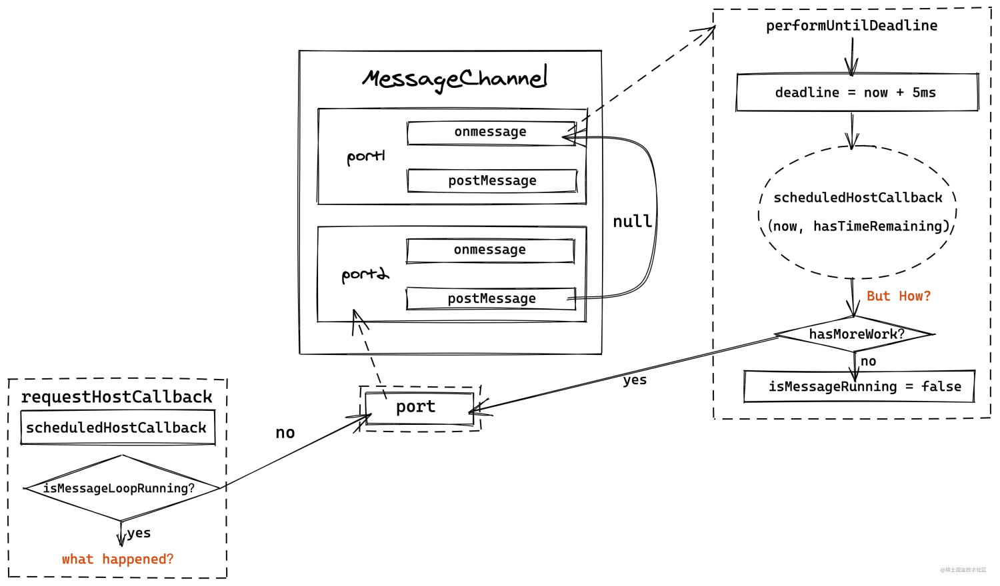
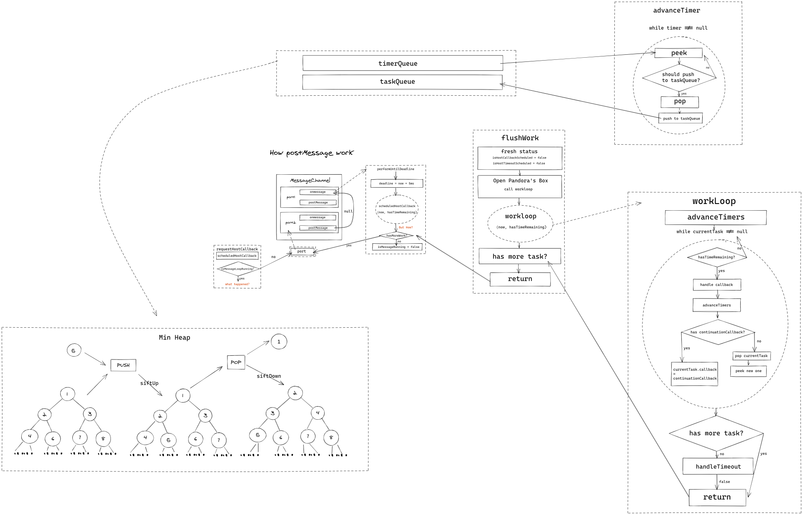

---
group:
  order: 1
title: React源码解析之Scheduler
---

## Scheduler是什么
Scheduler相对于react整体是相对独立的模块，虽然代码量不是很多。但是理解起来还是比较困难的。很多人都是停留在大致的了解，甚至很多人会认为react的调度是使用requestIdleCallback去做的，或者只是认为Scheduler是一个类似于实现浏览器requestIdleCallback的库，实现react的调度功能。Scheduler是一个任务调度器，它会根据任务的优先级对任务进行调用执行。在有多个任务的情况下，它会先执行优先级高的任务。如果一个任务执行的时间过长，Scheduler会中断当前任务，让出线程的执行权，避免造成用户操作时界面的卡顿。在下一次恢复未完成的任务的执行。

## 进入调度
```javascript
function ensureRootIsScheduled(root: FiberRoot, currentTime: number){
       ...
       let schedulerPriorityLevel;
       // 通过lanesToEventPriority函数将lane优先级转化为Scheduler优先级
       switch (lanesToEventPriority(nextLanes)) {
          case DiscreteEventPriority:
            schedulerPriorityLevel = ImmediateSchedulerPriority;
            break;
          case ContinuousEventPriority:
            schedulerPriorityLevel = UserBlockingSchedulerPriority;
            break;
          case DefaultEventPriority:
            schedulerPriorityLevel = NormalSchedulerPriority;
            break;
          case IdleEventPriority:
            schedulerPriorityLevel = IdleSchedulerPriority;
            break;
          default:
            schedulerPriorityLevel = NormalSchedulerPriority;
            break;
        }
        //将react与scheduler连接，将react产生的事件作为任务使用scheduler调度
        newCallbackNode = scheduleCallback(
          schedulerPriorityLevel,
          performConcurrentWorkOnRoot.bind(null, root),
        );
   }
```
React和Scheduler的优先级是先对独立的，内部有都有一套自己的优先级机制，所以使用scheduleCallback的时候，需要做一次优先级的转换。

## MessageChannel 与requestIdleCallback
大家都知道在16版本，react推出了时间分片的概念。而requestIdleCallback能够在浏览器空闲时间去执行js代码。react最开始确实是使用的requestIdleCallback来实现的。但是后来替换成了MessageChannel。
- 由于requestIdleCallback依赖于显示器的刷新频率，使用时需要看vsync cycle（指硬件设备的频率）的脸色
- 为了尽量在每帧尽可能多地执行任务，采用了5ms间隔的消息event来发起调度，这里就利用了postMessage的方式
- postMessage的方式也存在风险，因为更加频繁的调度任务，会加剧主线程与其他浏览器任务的资源争夺
- 相比于requestIdleCallback和setTimeout，浏览器在后台标签下对消息事件进行了什么程度的节流还需要进一步确定，该试验是假设它与定时器有相同的优先级。
- 不使用setTimeout(fn, 0)是因为setTimeout会有一定的延迟（4-5ms），如果使用 setTimeout(fn, 0) 实现 Scheduler，就会浪费4-5毫秒。因为 60 FPS 要求每帧间隔不超过 16.66 ms，所以 4ms 是不容忽视的浪费。
- 不使用requestAnimationFrame(fn)，我们知道 rAF() 是在页面更新之前被调用，rAF() 的触发间隔时间不确定，如果浏览器间隔了 10ms 才更新页面，那么这 10ms 就浪费了。
总结与句话：采用MessageChannel,是放弃了浏览器对帧的依赖策略，转为认为控制调度的频率。提升了任务的处理速度，优化React运行时的性能。

## Scheduler的优先级:
```javascript
export type PriorityLevel = 0 | 1 | 2 | 3 | 4 | 5;

// TODO: Use symbols?
export const NoPriority = 0; // 无优先级
export const ImmediatePriority = 1; // 立即执行
export const UserBlockingPriority = 2; //  用户阻塞优先级
export const NormalPriority = 3; // 一般的优先级
export const LowPriority = 4; // 低级的优先级
export const IdlePriority = 5; // 空闲再执行的优先级
```

## Schedule的原理
### 计算time
startTime：根据是否设置delay，获取当前时间，还是当前时间+delay。
timeout：不同的优先级有不同的延迟时间。如下代码switch中根据不同的优先级，设置不同的过期时间。
expirationTime = startTime + timeout;更新过程中，判读本次异步任务是否超时。
```javascript
function unstable_scheduleCallback(priorityLevel, callback, options) {
  // 根据 performance 对象及 performance.now 方法是否存在，区分了是用 Date.now 还是用 performance.now 来获取当前时间，原因是后者比前者更加精确切绝对
  var currentTime = getCurrentTime();

  var startTime;
  if (typeof options === 'object' && options !== null) {
    var delay = options.delay;
    if (typeof delay === 'number' && delay > 0) {
      startTime = currentTime + delay;
    } else {
      startTime = currentTime;
    }
  } else {
    startTime = currentTime;
  }

  var timeout;
  switch (priorityLevel) {
    case ImmediatePriority:
      timeout = IMMEDIATE_PRIORITY_TIMEOUT;
      break;
    case UserBlockingPriority:
      timeout = USER_BLOCKING_PRIORITY_TIMEOUT;
      break;
    case IdlePriority:
      timeout = IDLE_PRIORITY_TIMEOUT;
      break;
    case LowPriority:
      timeout = LOW_PRIORITY_TIMEOUT;
      break;
    case NormalPriority:
    default:
      timeout = NORMAL_PRIORITY_TIMEOUT;
      break;
  }

  var expirationTime = startTime + timeout;
	...
}
```
<br/>


### 任务队列维护
Scheduler用于调度任务，为了防止浏览器主线程长时间忙于运行一些事情，关键任务却被推迟，因此任务需要进行优先级排序。每次优先执行优先级最高的任务。Scheduler采用Heap堆存放任务队列。

根据优先级的高低，shceudler采用位运算取中位节点的方式，交换heap堆中任务的位置。
添加任务、移除任务会用到Shceduler中的工具方法（packages/scheduler/src/SchedulerMinHeap.js）(例如push,peek等)。最后构造了两个任务队列taskQueue和timeQueue。
- taskQueue: 存放将被处理的任务
- timeQueue: 存放延期处理的任务
每个任务存放Heap堆之前，会根据sortIndex,id属性进行优先级排序。
- sortIndex: 值越小，优先级越高
- id：是任务创建的顺序，id越小，优先级越高

#### 创建任务
```javascript
var taskIdCounter = 1;

...

function unstable_scheduleCallback(priorityLevel, callback, options) {
// 计算各种时间
// .....

// 创建新任务
  var newTask = {
    id: taskIdCounter++, // 任务节点的序号，创建任务时通过taskIdCounter 自增 1
    callback, // 执行的任务函数
    priorityLevel, // 任务的优先级。优先级按 ImmediatePriority、UserBlockingPriority、NormalPriority、LowPriority、IdlePriority 顺序依次越低
    startTime, // 时间戳，任务预期执行时间，默认为当前时间，即同步任务。可通过 options.delay 设为异步延时任务
    expirationTime, // 过期时间，scheduler 基于该值进行异步任务的调度。通过 options.timeout 设定或 priorityLevel 计算 timeout 值后，timeout 与 startTime 相加称为 expirationTime
    sortIndex: -1, // 默认值为 -1。对于异步延时任务，该值将赋为 expirationTime
  };

// ....存放任务
}
```

#### 添加任务
```javascript
// 任务队列创建
var taskQueue = []; // 存放马上要执行的任务
var timerQueue = []; //  存放延时任务，即 `startTime > currentTime`的任务 

var isSchedulerPaused = false; // 调度是否中断: 暂停调度程序对于调试很有用。
var currentTask = null; // 当前执行的任务。执行任务调度时做记录作用。
var currentPriorityLevel = NormalPriority; // 默认当前的优先级为一般优先级（该变量会在全局进行使用，经常会有地方 getCurrentPriorityLevel,就是返回这个值）
var isPerformingWork = false; // 这是在执行工作时设置的，以防止重新进入。

// 是否有回调函数调度（是否安排了主任务）
var isHostCallbackScheduled = false;
var isHostTimeoutScheduled = false;

function unstable_scheduleCallback(priorityLevel, callback, options) {
  // 计算过期时间
  // ...
  // 创建新任务
  // ...

  // startTime > currentTime,表示还未达到执行时间。是一个延时任务
  if (startTime > currentTime) {
    // 将startTime 设置为sortIndex, 前面提到，该变量用于任务在taskQueue/ timeQueue中排序
    newTask.sortIndex = startTime; // This is a delayed task.
	// 存入异步任务(排序)
    push(timerQueue, newTask);
	// taskQueue无即时任务， 并且当前新任务优先级最高
    if (peek(taskQueue) === null && newTask === peek(timerQueue)) {
      // All tasks are delayed, and this is the task with the earliest delay.
	  // 判断是否有在等待调度的延时任务，如果有则进行取消，因为这是优先级最高的延迟任务。
      if (isHostTimeoutScheduled) {
        // 取消之前的延迟任务
        cancelHostTimeout();
      } else {
        isHostTimeoutScheduled = true;
      }
	  //startTime - currentTime秒后执行handleTimeout，将timeQueue中的task推入taskQueue
      requestHostTimeout(handleTimeout, startTime - currentTime); 
    }
  } else {
	// 将expirationTime作为sortIndex,用于即将执行的任务队列(taskQueue)的排序
    newTask.sortIndex = expirationTime;
    push(taskQueue, newTask);
   
	// isHostCallbackScheduled： 是否有主任务正在执行
	// isPerformingWork: 一个标识,用于确认performWorkUntilDeadline 是否正处于递归的执行状态中
    if (!isHostCallbackScheduled && !isPerformingWork) {
	 // 无主任务执行，performWorkUntilDeadline 也不在递归调用 进入该流程

      isHostCallbackScheduled = true;
      requestHostCallback(flushWork);
    }
  }
  return newTask;
}
```
上面两种任务
- taskQueue：使用的是requestHostCallback，可以理解为正常的任务队列。每次任务调度，都是执行的这里面的任务。
- timerQueue：是一些延迟任务的队列，执行requestHostTimeout(handleTimeout, startTime - currentTime); 其实就是执行setTimeout，一定时间后回调handleTimeout。在handleTimeout中会执行advanceTimers方法将到时间的任务推入taskQueue中。

#### scheduleCallback 总流程
1. 计算开始时间、过期时间。
2. 创建任务。
3. 判断任务类型（延时任务、即时任务），延时任务，存入timerQueue，通过requestHostTimeout轮询，到任务到时间了，则推入taskQueue。即时任务，存入taskQueue，则调用requestHostCallback进入正常的任务调度。
<br/>


#### requestHostCallback
```javascript
// 定义channel对象
const channel = new MessageChannel();
// 获取到port2，用来发消息
const port = channel.port2;
// 接收port2发送来的消息
channel.port1.onmessage = performWorkUntilDeadline;

requestHostCallback = function(callback) {
  // 全局变量记录当前要执行的任务回调。
  scheduledHostCallback = callback;
  // 如果消息循环没有打开，则进行打开，并且发一个新的消息。如果已经打开，说明已经有任务在执行了。
  if (!isMessageLoopRunning) {
    isMessageLoopRunning = true;
     // 发起消息， performWorkUntilDeadline 函数接收消息执行任务
    port.postMessage(null);
  }
};

// 取消任务
cancelHostCallback = function() {
	// 将 立即执行任务设置为null
    scheduledHostCallback = null;
};
```
<br/>

```javascript
const performWorkUntilDeadline = () => {
	 // 判断 `立即执行任务`是否为空
    if (scheduledHostCallback !== null) {
	// 获取当前时间（performance.now() 或者 Date.now() - React应用程序启动time）
      const currentTime = getCurrentTime();
	  //在`yieldInterval` ms之后暂停，无论我们在vsync循环中处于什么位置。
      //这意味着在message 事件前总是有剩余的时间。
      deadline = currentTime + yieldInterval;

	  // 是否含有剩余时间
      const hasTimeRemaining = true;
      try {
        const hasMoreWork = scheduledHostCallback(
          hasTimeRemaining,
          currentTime,
        );

		// 是否还有更多的任务要做
        if (!hasMoreWork) {
		  // 没有任务则 将 消息循环标志 设为false
		  // 清除 立即执行任务
          isMessageLoopRunning = false;
          scheduledHostCallback = null;
        } else {
          // 如果还有更多工作要做，请将下一个消息事件安排在前一个事件的末尾。
          port.postMessage(null);
        }
      } 
    } else {
	 // 立即执行任务为空，关闭循环标志
      isMessageLoopRunning = false;
    }
    // 将needsPaint 标记打上false
    needsPaint = false;
  };
```
<br/>


### scheduledHostCallback
在上面的performWorkUntilDeadline，主要是调用scheduledHostCallback方法，然后做一些逻辑处理，通过代码可以知道scheduledHostCallback是通过requestHostCallback调度的时候，传入的callback。就是requestHostCallback(flushWork);中的flushWork。

```javascript
function flushWork(hasTimeRemaining, initialTime) {
  if (enableProfiling) {
    markSchedulerUnsuspended(initialTime);
  }

  // 由于 requestHostCallback 并不一定立即执行传入的回调函数，所以 isHostCallbackScheduled 状态可能会维持一段时间；
  // 等到 flushWork 开始处理任务时，则需要释放该状态以支持其他的任务被 schedule 进来；
  // isHostTimeoutScheduled 也是同样的道理，关于这是个什么 timeout，我们很快就会遇到
  isHostCallbackScheduled = false;
  if (isHostTimeoutScheduled) {
    // We scheduled a timeout but it's no longer needed. Cancel it.
    isHostTimeoutScheduled = false;
    cancelHostTimeout();
  }
  // flushWork 就是返回 workLoop 的结果，
  isPerformingWork = true;
  const previousPriorityLevel = currentPriorityLevel;
  try {
    if (enableProfiling) {
      try {
        return workLoop(hasTimeRemaining, initialTime);
      } catch (error) {
        if (currentTask !== null) {
          const currentTime = getCurrentTime();
          markTaskErrored(currentTask, currentTime);
          currentTask.isQueued = false;
        }
        throw error;
      }
    } else {
      // No catch in prod code path.
      return workLoop(hasTimeRemaining, initialTime);
    }
  } finally {
    currentTask = null;
    currentPriorityLevel = previousPriorityLevel;
    isPerformingWork = false;
    if (enableProfiling) {
      const currentTime = getCurrentTime();
      markSchedulerSuspended(currentTime);
    }
  }
}
```
```javascript
function workLoop(hasTimeRemaining, initialTime) {
  let currentTime = initialTime;
  // 开始任务之前，先去判断延时任务的队列中是否有过期任务，如果有，则push到即时任务中。
  advanceTimers(currentTime);、
 	// 获取优先级最高的任务。
  currentTask = peek(taskQueue);
  while (
    currentTask !== null &&
    !(enableSchedulerDebugging && isSchedulerPaused)
  ) {
    // dealine 到了，但是当前任务尚未过期，因此让它在下次调度周期内再执行
    if (
      currentTask.expirationTime > currentTime &&
      (!hasTimeRemaining || shouldYieldToHost())
    ) {
      // This currentTask hasn't expired, and we've reached the deadline.
      break;
    }
    // callback是一个function，则说明当前任务是可用的
    const callback = currentTask.callback;
    if (typeof callback === 'function') {
      // 重置callback，等下会调用callback，如果返回了continuationCallback，则继续使用currentTask对象
      currentTask.callback = null;
      currentPriorityLevel = currentTask.priorityLevel;
       // 判断当前任务是否过期
      const didUserCallbackTimeout = currentTask.expirationTime <= currentTime;
      if (enableProfiling) {
        markTaskRun(currentTask, currentTime);
      }
      // 将任务是否已经过期的状态传给了任务本身，如果该任务支持根据过期状态有不同的行为——例如在过期状态下，
      // 将当前的执行结果缓存起来，等到下次调度未过期的时候再复用缓存的结果继续执行后面的逻辑，
      // 那么则返回新的处理方式并赋值到 continuationCallback 上
      const continuationCallback = callback(didUserCallbackTimeout);
      currentTime = getCurrentTime();
      if (typeof continuationCallback === 'function') {
        currentTask.callback = continuationCallback;
        if (enableProfiling) {
          markTaskYield(currentTask, currentTime);
        }
      } else {
        if (enableProfiling) {
          markTaskCompleted(currentTask, currentTime);
          currentTask.isQueued = false;
        }
        // 如果currentTask是最新的任务，则pop出。
        if (currentTask === peek(taskQueue)) {
          pop(taskQueue);
        }
      }
      // 执行完任务之后，先去判断延时任务的队列中是否有过期任务，如果有，则push到即时任务中。
      advanceTimers(currentTime);
    } else {
      // 如果当前的任务已经不可用，则将它 pop 掉
      pop(taskQueue);
    }
    // 再次从 taskQueue 中 peek 一个任务出来
    // 注意，如果前面的 continuationCallback 成立，taskQueue 则不会发生 pop 行为，
    // 因此 peek 出的任务依然是当前的任务，只是 callback 已经是 continuationCallback 了
    currentTask = peek(taskQueue);
  }
  // Return whether there's additional work
  // 这里就是 performWorkUntilDealine 中的 hasMoreWork 逻辑！
  if (currentTask !== null) {
    return true;
  } else {
    const firstTimer = peek(timerQueue);
    if (firstTimer !== null) {
      requestHostTimeout(handleTimeout, firstTimer.startTime - currentTime);
    }
    return false;
  }
}
```

中止判断条件
- currentTask.expirationTime > currentTim：首先会判断当前任务的过期时间是否大于当前时间，大于则说明当前任务还没有过期不用现在执行，先将执行权让给已过期的任务。
- !hasTimeRemaining：表示是否还有剩余时间，剩余时间不足则需要中断当前任务，让其他任务先执行，hasTimeRemaining一直为true，我们可以暂时忽略这个条件。
```javascript
function shouldYieldToHost() {
  const timeElapsed = getCurrentTime() - startTime;
  if (timeElapsed < frameInterval) {
    return false;
  }
 
  if (enableIsInputPending) {
    if (needsPaint) {
      return true;
    }
    if (timeElapsed < continuousInputInterval) {
      if (isInputPending !== null) {
        return isInputPending();
      }
    } else if (timeElapsed < maxInterval) {
      if (isInputPending !== null) {
        return isInputPending(continuousOptions);
      }
    } else {
      return true;
    }
  }
  return true;
}
```
首先检查当前任务的使用时间是否小于帧间隔时间，小于则返回false表示无需中断
startTime是在调用performWorkUntilDeadline时赋的值，也就是任务开始调度的时候的开始时间：
```javascript
const performWorkUntilDeadline = () => {
  ...
    startTime = currentTime;
  ...
};
```
如果大于表示当前任务的执行时间超过了一帧渲染的时间5ms，会让用户操作造成卡顿，则返回true表示需要中断。

关于isInputPending它的作用是检测用户的输入事件，例如：鼠标点击，键盘输入等，如果有用户输入测返回true，没有则返回false。

执行状态
那么执行执行状态如果判断的呢？

首先我们先来看回顾一下调用scheduleCallback的函数ensureRootIsScheduled中的源码：
```javascript
function ensureRootIsScheduled(root: FiberRoot, currentTime: number) {
  ...
  newCallbackNode = scheduleCallback(
    schedulerPriorityLevel,
    performConcurrentWorkOnRoot.bind(null, root),
  );

  root.callbackPriority = newCallbackPriority;
  root.callbackNode = newCallbackNode;
}
```
可以看到，调用scheduleCallback函数后会将任务对象newTask返回回来，并挂载到root的callbackNode属性上

接下来我们进入callback函数中，也就是performConcurrentWorkOnRoot中看一下具体是如果判断执行状态的：
```javascript
function performConcurrentWorkOnRoot(root, didTimeout) {
  const originalCallbackNode = root.callbackNode;
  
  ...
  
  let exitStatus =
    shouldTimeSlice(root, lanes) &&
    (disableSchedulerTimeoutInWorkLoop || !didTimeout)
      ? renderRootConcurrent(root, lanes)
      : renderRootSync(root, lanes);
  
  if (root.callbackNode === originalCallbackNode) {
    return performConcurrentWorkOnRoot.bind(null, root);
  }
  return null;
}
```
从源码中我们看到，首先将root.callbackNode赋值给了originalCallbackNode变量，中间会调用renderRootConcurrent或者renderRootSync方法，那么我们可以判定到root.callbackNode肯定会在这两个方法中被消耗掉。
然后可以看到root.callbackNode在commit阶段被置为了null：
```javascript
function commitRootImpl(root, renderPriorityLevel) {
  ...
  root.callbackNode = null;
  root.callbackPriority = NoLane;
  ...
}
```
react整个构建流程大致可以分为两个阶段：

render阶段，在这个阶段任务是可以被中断的
commit阶段，这个阶段任务是无法被中断的
我们回过头再来看一下performConcurrentWorkOnRoot函数中的代码：
然后可以看到root.callbackNode在commit阶段被置为了null：
```javascript
function performConcurrentWorkOnRoot(root, didTimeout) {
  ...
  
  if (root.callbackNode === originalCallbackNode) {
    return performConcurrentWorkOnRoot.bind(null, root);
  }
  return null;
}
```
如果当任务执行到commit阶段，那么任务肯定已经完成了，root.callbackNode会被置为null，那么if判断肯定是不想等的，所以会返回null，那么workloop中的continuationCallback的值也会null，表示任务已执行完成。
那么任务在执行过程中被中断了呢？
我们来看一下并发渲染函数renderRootConcurrent：
```javascript
function renderRootConcurrent(root: FiberRoot, lanes: Lanes) {
  ...
  
  do {
    try {
      workLoopConcurrent();
      break;
    } catch (thrownValue) {
      handleError(root, thrownValue);
    }
  } while (true);
  
  ...

}
```
其内部调用了workLoopConcurrent函数：
```javascript
function workLoopConcurrent() {
  while (workInProgress !== null && !shouldYield()) {
    performUnitOfWork(workInProgress);
  }
}
```
可以看到这个函数在循环创建workInProgress树，并且调用了shouldYield函数，之前我们有解析过shouldYield函数中主要是检查当前任务的执行时间是否大于一帧所渲染的时间，并且会使用isInputPendingAPI来判断用户是否对页面有交互，如果满足其中一个条件则会中断当前任务。中断向下执行任务则不会继续，也就不会执行到commit阶段。
## 总结
<br/>
